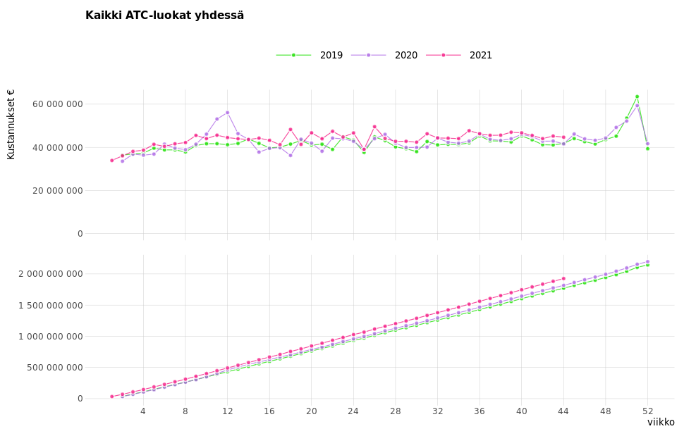
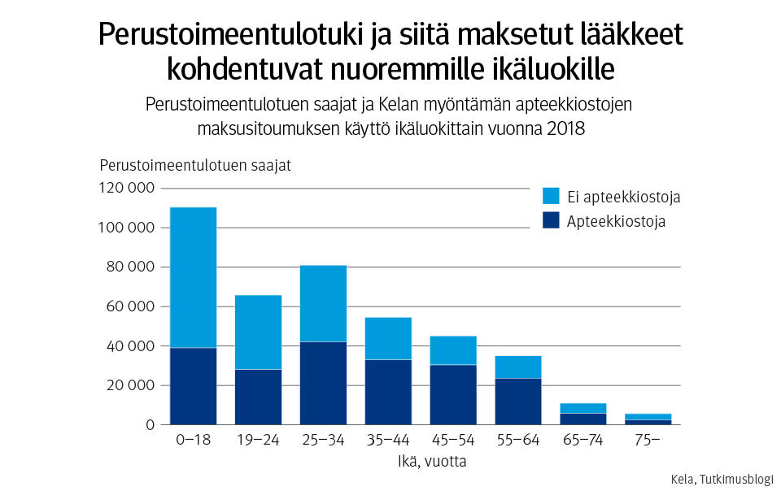
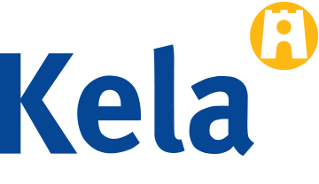

```{r setup2, include=FALSE}
plot(cars)
```

<main id="maincontent">

<div style = "padding: 20px"></div>
<h2 class = "yellow-line-3 col-sm-12" id = "ajankohtaista">Ajankohtaista</h2>

<!--div class="row">
<div class="col-sm-6">
<div class="card" style="width: 90%;">
<a href="https://tutkimusblogi.kela.fi/arkisto/5254" title="Avaa sovellus"></a>
<div class="card-body">
<a href="https://tutkimusblogi.kela.fi/arkisto/5254" title="Avaa sovellus"><h5 class="card-title">Uusi sovellus lääkekulutuksen seurantaan – lääkkeiden hamstraus suurimmillaan viikolla 12</h5></a>
<p class="card-text">Kela on julkaissut sovelluksen, jonka avulla voi seurata korvattavien reseptilääkkeiden kulutusta. Sovelluksen avulla nähdään, että erityisesti hengityselinsairauksien hoitoon tarkoitettuja valmisteita on ostettu koronavirusepidemian aikaan tavallista suurempia määriä.
</p>
</div>
</div>
</div>
<div class="col-sm-6">
<div class="card" style="width: 90%;">
<a href="https://tutkimusblogi.kela.fi/arkisto/5568" title="Avaa sovellus uuteen välilehteen"></a>
<div class="card-body">
<a href="https://tutkimusblogi.kela.fi/arkisto/5568" title="Avaa sovellus"><h5 class="card-title">Avo- ja laitoshoidon lääkekustannusten kasvu ja lasku lääkeaineittain
</h5></a>
<p class="card-text">Lääkekustannuksia korvataan ensisijaisesti sairausvakuutuksesta, mutta osan kustannuksista maksaa viimesijaisin etuus, perustoimeentulotuki. Sosiaaliturvauudistuksessa lääkekorvausjärjestelmää ja lääkkeiden maksamista toimeentulotuesta tulisikin tarkastella kokonaisuutena.
</p>
</div>
</div>
</div>
</div-->

<!--h3 >10 uusinta tutkimusblogia aihetunnisteella <code>#lääkekorvaus, #lääkkeet</code></h2-->
<div style = "padding: 20px"></div>

<!--dynamic_content01_begins-->
<dl class="row"><div class = "col-sm-6"><div style = "padding-top: 10px;"></div><h5>Uutta Kelan tutkimusblogissa</h5>
<dl class="row">
<dd class="col-sm-12"><div class = "yellow-line">2021-11-22</div>
<a class = "laake-link" href="https://tutkimusblogi.kela.fi/arkisto/6258">Kela-korvausten pienentyminen näkyy erityisesti pienituloisten korvauksissa – onko sairaanhoitovakuutusjärjestelmä reilu?<i class="bi-chevron-right"></i></a> 

<!--strong>Aiheeton, Mikkola Hennamari, Räsänen Tapio, Kela-korvaus, lääkekorvaukset,</strong><br/-->
<!--i>Kokonaisuutena sairaanhoitovakuutuksen korvaukset jakautuvat tasaisesti suuri- ja pienituloisille, koska lääkekorvaukset muodostavat suurimman osan korvauksista. Korvauksista on kuitenkin tullut osin entistä keskittyneempiä: suurituloiset käyttävät yhä suuremman osan korvauksista yksityisiin lääkäripalveluihin, kun taas pienituloiset käyttävät enemmän matkakorvauksia. Yli 50 vuotta käytössä ollut sairausvakuutus koostuu sairaanhoito- ja työtulovakuutuksesta. Erityisesti sairaanhoitovakuutus ja sen Kela-korvaukset ovat herättäneet julkista keskustelua. STM:n ...<a href="https://tutkimusblogi.kela.fi/arkisto/6258"> Lue lisää</a></i-->
</dd></dl>
<dl class="row">
<dd class="col-sm-12"><div class = "yellow-line">2021-06-04</div>
<a class = "laake-link" href="https://tutkimusblogi.kela.fi/arkisto/6023">Tyypin 2 diabeteslääkkeiden kulutus väheni korvaustason laskun jälkeen<i class="bi-chevron-right"></i></a> 

<!--strong>Aaltonen Katri, Rättö Hanna, diabetes, diabeteslääkkeet, insuliini,</strong><br/-->
<!--i>Tuoreen tutkimuksen mukaan tyypin 2 diabeteslääkkeiden ostajaa kohden laskettu keskimääräinen kuukausikulutus väheni näiden lääkkeiden korvaustason alentamisen jälkeen. Insuliinien kulutuksessa ei havaittu kasvua. Vuoden 2017 alussa tyypin 2 diabeteslääkkeiden korvaustasoa alennettiin ylemmästä 100 prosentin korvausluokasta alempaan 65 prosentin korvausluokkaan. Tarkastelimme aiemmassa blogissamme korvaustason laskun vaikutusta toimeentulotuen käyttöön. Tässä uuteen vuodet 2014-2018 kattavaan tutkimukseemme perustuvassa kirjoituksessa tarkastelemme ...<a href="https://tutkimusblogi.kela.fi/arkisto/6023"> Lue lisää</a></i-->
</dd></dl>
<dl class="row">
<dd class="col-sm-12"><div class = "yellow-line">2021-05-07</div>
<a class = "laake-link" href="https://tutkimusblogi.kela.fi/arkisto/5965">Tyypin 2 diabeteslääkkeiden omavastuun korotus lisäsi toimeentulotuen maksusitoumuksen käyttöä<i class="bi-chevron-right"></i></a> 

<!--strong>Aaltonen Katri, Rättö Hanna, diabetes, diabeteslääkkeet, lääkekorvaukset,</strong><br/-->
<!--i>Tuore tutkimus osoittaa, että vuoden 2017 omavastuukorotus lisäsi toimeentulotuen maksusitoumuksen käyttöä tyypin 2 diabeteslääkkeiden ostamisessa. Korvaustason alentaminen näyttää kasvattaneen potilaiden lääkelaskua. &#160; Tyypin 2 diabeteksen hoidossa käytettävien lääkkeiden korvaustasoa insuliineja lukuun ottamatta alennettiin vuonna 2017 osana hallituksen säästötoimia. Ne siirrettiin ylemmästä, 100 prosentin erityiskorvausluokasta alempaan, 65 prosentin erityiskorvausluokkaan. Esityksessään (HE 184/2016 vp) hallitus arvioi, että ...<a href="https://tutkimusblogi.kela.fi/arkisto/5965"> Lue lisää</a></i-->
</dd></dl>
<dl class="row">
<dd class="col-sm-12"><div class = "yellow-line">2021-03-26</div>
<a class = "laake-link" href="https://tutkimusblogi.kela.fi/arkisto/5889">Yksityisen sektorin rooli lääkkeiden määräämisessä vaihtelee maakunnittain<i class="bi-chevron-right"></i></a> 

<!--strong>Heino Pekka, Kari Heini, Koskinen Hanna, Rättö</strong><br/-->
<!--i>Yksityisen sektorin osuus määrätyistä resepteistä vaihteli maakunnittain 13–31 prosentin välillä. Koko maan tasolla yksityisellä sektorilta määrättyjen reseptien osuus sairausvakuutuksen lääkekustannuksista oli arviolta noin 21 % ja korvauksista vajaat 19 %. Tarkempaa tietoa tarvitaan esimerkiksi työterveyshuollon roolista. Terveydenhuollon järjestämiseen ja rahoitukseen liittyvää vastuuta on tarkoitus keskittää hyvinvointialueille sote-uudistuksessa. Vastuun siirtämistä hyvinvointialueille selvitetään myös julkisin varoin katettavien ...<a href="https://tutkimusblogi.kela.fi/arkisto/5889"> Lue lisää</a></i-->
</dd></dl>
<dl class="row">
<dd class="col-sm-12"><div class = "yellow-line">2021-03-25</div>
<a class = "laake-link" href="https://tutkimusblogi.kela.fi/arkisto/5882">Kerralla kattoon – mistä lääkehoidoista on kyse?<i class="bi-chevron-right"></i></a> 

<!--strong>Heino Pekka, Koskinen Hanna, Kurko Terhi, Tillman</strong><br/-->
<!--i>Heti kalenterivuoden ensimmäisellä lääkeostolla tapahtuvista lääkekaton ylityksistä suurin osa aiheutuu biologisen valmisteen lääkeostosta. Maksukattojen yhdistämisen ja erilaisten kertymistapojen lisäksi tulee keskustella lääkkeiden hinnoista ja niihin vaikuttamisesta. Terveydenhuollon kustannuksiin, erityisesti sairausvakuutuksen korvaamiin lääkkeisiin ja matkoihin liittyvistä asiakkaiden omavastuumaksujen katoista ja niiden yhtäaikaisen vuodenvaihteessa tapahtuvan nollautumisen tuomasta taloudellisesta rasitteesta on keskusteltu viime aikoina aktiivisesti, ks. esim. Kelan ...<a href="https://tutkimusblogi.kela.fi/arkisto/5882"> Lue lisää</a></i-->
</dd></dl>
<dl class="row">
<dd class="col-sm-12"><div class = "yellow-line">2021-01-19</div>
<a class = "laake-link" href="https://tutkimusblogi.kela.fi/arkisto/5794">Liukuva lääke- ja matkakatto voisi auttaa alkuvuoteen kasautuviin suuriin sairauskuluihin<i class="bi-chevron-right"></i></a> 

<!--strong>Heino Pekka, Soppi Aarni, Tillman Päivi, lääkekatto,</strong><br/-->
<!--i>Lääkekatto (579,78 euroa) täyttyi vuoden 2021 kahden ensimmäisen viikon aikana 1952 henkilöllä, joista 1604:lla heti ensimmäisellä lääkeostolla. Jos vuosikatto määräytyisi Suomessakin Ruotsin tapaan liukuvasti ja kertymäkausi alkaisi ensimmäisestä matkasta tai lääkeostosta eikä kaikilla vuoden alusta, suuret maksut eivät kertyisi alkuvuoteen. Terveydenhuollon omavastuut ja asiakasmaksut puhututtavat tyypillisesti alkuvuonna, kun vuosikatot ovat vuodenvaihteessa nollautuneet ja maksut peritään ...<a href="https://tutkimusblogi.kela.fi/arkisto/5794"> Lue lisää</a></i-->
</dd></dl>
<dl class="row">
<dd class="col-sm-12"><div class = "yellow-line">2021-01-14</div>
<a class = "laake-link" href="https://tutkimusblogi.kela.fi/arkisto/5749">Avohoidon lääkekustannukset vaihtelevat maakunnittain – tulevaisuudessa korostuvat tiedolla johtaminen ja kokonaisuuden hallinta<i class="bi-chevron-right"></i></a> 

<!--strong>Heino Pekka, Kari Heini, Koskinen Hanna, Rättö</strong><br/-->
<!--i>Maakunnat voivat tulevaisuudessa rahoittaa avohoidon lääkekorvausmenoja. Lääkkeiden kustannukset ja sairausvakuutuskorvausten määrät kuitenkin eroavat maakuntien välillä. Maakuntien tai tulevaisuuden hyvinvointialueiden rahoitusvastuun laajentaminen edellyttää tiedolla johtamista ja tiedon laaja-alaista hyödyntämistä.   Sote-uudistuksen yhteydessä halutaan purkaa sosiaali- ja terveydenhuollon monikanavarahoitusta. Sosiaali- ja terveysministeriö asetti marraskuussa 2020 purkamista pohjustavia valmisteluryhmiä. Lääkekorvauksien valmisteluryhmän tehtävänä on selvittää, mitä osaa sairaanhoitokorvauksista ja ...<a href="https://tutkimusblogi.kela.fi/arkisto/5749"> Lue lisää</a></i-->
</dd></dl>
<dl class="row">
<dd class="col-sm-12"><div class = "yellow-line">2020-10-02</div>
<a class = "laake-link" href="https://tutkimusblogi.kela.fi/arkisto/5568">Lääkkeiden kustannuksia maksetaan myös toimeentulotuesta<i class="bi-chevron-right"></i></a> 

<!--strong>Kari Heini, Rättö Hanna, lääkekorvaukset, lääkkeet, toimeentulotuki</strong><br/-->
<!--i>Lääkekustannuksia korvataan ensisijaisesti sairausvakuutuksesta, mutta osan kustannuksista maksaa viimesijaisin etuus, perustoimeentulotuki. Sosiaaliturvauudistuksessa lääkekorvausjärjestelmää ja lääkkeiden maksamista toimeentulotuesta tulisikin tarkastella kokonaisuutena. Toimeentulotuki muodostaa sairausvakuutuksen lääkekorvausjärjestelmälle osin täydentävän ja osin sille rinnakkaisen lääkkeiden julkisen maksukanavan. Järjestelmien perusteet lääkekustannusten maksamiselle ovat erilaiset. Tarkastelemme tässä kirjoituksessa kahta lääkekustannuksia maksavaa julkista kanavaa, sairausvakuutuksen lääkekorvausjärjestelmää ja perustoimeentulotukea. Aihetta on tarkasteltu laajemmin ...<a href="https://tutkimusblogi.kela.fi/arkisto/5568"> Lue lisää</a></i-->
</dd></dl>
<!--a href = "https://tutkimusblogi.kela.fi/avainsanat/laakkeet">Lue lisää Kelan tutkimusblogista</a-->
</div>
<div class = "col-sm-6"><div style = "padding-top: 10px;"></div><h5>Ajankohtaista Fimeasta</h5>
<dl class="row">
<dd class="col-sm-12"><div class = "yellow-line">2021-11-26</div>
<a class = "laake-link" href="http://www.fimea.fi/web/guest/-/potilas-keskiossa-laakehoidon-riskeja-kasittelevissa-tyopajoissa">Potilas keskiössä lääkehoidon riskejä käsittelevissä työpajoissa<i class="bi-chevron-right"></i></a>
<!--strong>NA</strong><br/-->
<!--i>Osana Turvallinen lääkehoito -oppaan implementointiprojektia Fimea ja Potilas- ja asiakasturvallisuuden kehittämiskeskus järjestivät kaksi työpajaa, joihin osallistui ammattilaisia erilaisista toimintaympäristöistä. Työpajoissa keskusteltiin lääkehoidon riskeistä ja niihin varautumisesta. Ilahduttavasti potilas ja asiakas nousivat keskustelun keskiöön molemmissa työpajoissa.Lääkehoidon osaaminen ja ajantasaisen lääkitystiedon puute keskeisiä riskejäKeskustelussa nousi esille useita erilaisia lääkehoidon riskejä, joita osallistujat olivat työssään havainneet. Ajantasaisen lääkitystiedon puute ja puutteet lääkehoidon kokonaisuuden hallinnassa sekä lääkehoidon osaamisessa olivat osallistujien mielestä merkittävimpiä lääkitysturvallisuusriskejä.Riskeihin varautumiseksi on keinojaRiskienhallinnan näkökulmasta tärkeinä pidettiin lääkehoidon katkeamattomuutta ja lääkitysturvallisuuden johtamista. Lääkityslistan ajantasaistaminen, yhtenäiset toimintamallit ja käytänteet, selkeät roolit ja vastuut sekä moniammatillinen yhteistyö nimettiin keinoiksi, joiden avulla riskeihin voisi varautua ja niitä voisi ennaltaehkäistä. Myös siirtotilanteiden sujuvoittaminen ja tietojärjestelmien kehittäminen tunnistettiin lääkitysturvallisuutta parantaviksi tekijöiksi.Turvallinen lääkehoito -sivustoLisätietoja:Emilia Laukkanen, projektikoordinaattori, Fimea,emilia.laukkanen@fimea.fiMarianne Kuusisto, lääkitysturvallisuuskoordinaattori,Potilas- ja asiakasturvallisuuden kehittämiskeskus,marianne.kuusisto@vshp.fi<a href="http://www.fimea.fi/web/guest/-/potilas-keskiossa-laakehoidon-riskeja-kasittelevissa-tyopajoissa"> Lue lisää</a></i-->
</dd></dl>
<dl class="row">
<dd class="col-sm-12"><div class = "yellow-line">2021-11-25</div>
<a class = "laake-link" href="http://www.fimea.fi/web/guest/-/ema-suosittelee-comirnaty-koronarokotteen-myyntilupaa-myos-5-11-vuotiaille-lapsille">EMA suosittelee Comirnaty-koronarokotteen myyntilupaa myös 5-11-vuotiaille lapsille<i class="bi-chevron-right"></i></a>
<!--strong>NA</strong><br/-->
<!--i>Euroopan lääkeviraston (EMA) lääkevalmistekomitea CHMP suosittelee Comirnaty-koronarokotteen käyttöaiheen laajentamista 5-11-vuotiaisiin lapsiin. Valmisteella on jo myyntilupa käyttöön aikuisten ja yli 12-vuotiaiden lasten rokottamisessa.5-11-vuotiaille annettava rokoteannos on pienempi (10 µg) kuin yli 12-vuotiaille annettavissa rokotteissa (30 µg). Rokotteen antaminen ja aika rokotusten välissä säilyy samana kuin vanhemmissa ryhmissä.Tutkimustulosten perusteella matalampi rokoteannos antaa 5-11-vuotiaille saman suojan kuin 16-25 -vuotiaille annettava annos. Tutkimuksessa 2000 lapsen koeryhmä sai rokotteesta 90.7% suojan oireellista Covid-19 -tartuntaa vastaan. Rokotteen suojatehon arvioidaan olevan 67.7% - 98.3%.Yleisimmät haittavaikutukset lapsilla ovat samankaltaisia kuin yli 12-vuotiaille rokotetuilla. Suurin osa haittavaikutuksista on lieviä ja ohimeneviä, esimerkiksi punoitusta rokotuskohdassa, kuumetta tai päänsärkyä. Tämän perusteella CHMP arvioi Comirnaty-rokotteen hyötyjen olevan haittoja suuremmat myös 5-11-vuotiaita rokottaessa.Rokotteen tehoa ja turvallisuutta lapsilla ja aikuisilla seurataan aktiivisesti EU:n lääketurvallisuusverkoston kautta. Fimea toimii aktiivisesti osana verkostoa.CHMP lähettää suosituksensa Euroopan komissiolle lopullista päätöstä varten.Lue lisää:EMA:n tiedote 25.11.2021trueMarjo-Riitta Helle, yksikön päällikkö, p. 0295223320Sähköpostiosoitteet ovat muotoa etunimi.sukunimi@fimea.fi.<a href="http://www.fimea.fi/web/guest/-/ema-suosittelee-comirnaty-koronarokotteen-myyntilupaa-myos-5-11-vuotiaille-lapsille"> Lue lisää</a></i-->
</dd></dl>
<dl class="row">
<dd class="col-sm-12"><div class = "yellow-line">2021-11-23</div>
<a class = "laake-link" href="http://www.fimea.fi/web/guest/-/tuotantoelainten-antibioottien-myynti-euroopassa-vahenee">Tuotantoeläinten antibioottien myynti Euroopassa vähenee<i class="bi-chevron-right"></i></a>
<!--strong>NA</strong><br/-->
<!--i>Tuotantoeläinten antibioottien kokonaismyynti Euroopassa on vähentynyt yli 40 % vuoden 2011 jälkeen, kertoo Euroopan lääkeviraston tuore ESVAC-raportti. Myös kriittisen tärkeitä antibiootteja myytiin aikaisempaa vähemmän tuotantoeläinten hoitoon. Maakohtaiset erot ovat edelleen suuria.Raportti kattaa vuosien 2010–2020 antibioottien myyntitiedot. Tulokset raportoidaan tuotantoeläinten määrään suhteutettuna.Lue lisää:EMA:n uutinen:&nbsp;More than 40% decrease in sales of antimicrobials for use in animals ESVAC 11. raporttiMaakohtaiset kommentit myyntitrendeihin 2010–2020 (Country reports)ESVAC-periaatteet lyhyesti Fimean verkkosivullatrueKatariina Kivilahti-Mäntylä, eläinlääkäri, p. 029 522 3354Sähköpostiosoitteet ovat muotoa etunimi.sukunimi@fimea.fi<a href="http://www.fimea.fi/web/guest/-/tuotantoelainten-antibioottien-myynti-euroopassa-vahenee"> Lue lisää</a></i-->
</dd></dl>
<dl class="row">
<dd class="col-sm-12"><div class = "yellow-line">2021-11-19</div>
<a class = "laake-link" href="http://www.fimea.fi/web/guest/-/euroopan-laakevirasto-aloittaa-paxlovid-koronalaakkeen-arvioinnin">Euroopan lääkevirasto aloittaa Paxlovid-koronalääkkeen arvioinnin<i class="bi-chevron-right"></i></a>
<!--strong>NA</strong><br/-->
<!--i>Euroopan lääkeviraston EMAn lääkevalmistekomitea (CHMP) on arvioimassa olemassa olevaa tutkimustietoa COVID-19 -taudin hoitoon kehitetystä Paxlovid-lääkevalmisteesta. Pfizerin Paxlovid-lääkkeen vaikuttavina aineina ovat PF-07321332 ja ritonaviiri, ja se on suun kautta otettava viruslääke aikuisille.Tutkimustulosten mukaan lääke vähentää vakavalle taudille alttiiden koronapotilaiden riskiä joutua sairaalahoitoon tai kuolla silloin, kun lääkitys aloitetaan 3-5 päivän sisällä oireiden alkamisesta. CHMP arvioi myös lääkkeen laatua ja turvallisuutta.&nbsp;Arvioinnin aloittamisen tavoitteena on tukea kansallisia terveysviranomaisia mahdollisissa hätäkäyttöratkaisuissa ennen varsinaisen myyntiluvan myöntämistä epidemiatilanteen vaikeutuessa Euroopassa. Arviointi mahdollistaa nopeasti EU-tasoisen ja tutkittuun tietoon perustuvan näkemyksen.Arviointi jatkuu myyntiluvan myöntämiseksi niin sanottuna rullaavana menettelynä. EMA tiedottaa arvioinnin tuloksista niiden valmistuessa.EMAn tiedote 19.11.2021:EMA starts review of Paxlovid for treating patients with COVID-19trueJukka Sallinen, yksikön päällikkö, p. 029 522 3410Marjo-Riitta Helle, yksikön päällikkö, p. 029 522 3320Sähköpostiosoitteet ovat muotoa etunimi.sukunimi@fimea.fi.<a href="http://www.fimea.fi/web/guest/-/euroopan-laakevirasto-aloittaa-paxlovid-koronalaakkeen-arvioinnin"> Lue lisää</a></i-->
</dd></dl>
<dl class="row">
<dd class="col-sm-12"><div class = "yellow-line">2021-11-19</div>
<a class = "laake-link" href="http://www.fimea.fi/web/guest/-/laaketietovarannon-toimintamalli-tarkentunut">Lääketietovarannon toimintamalli tarkentunut<i class="bi-chevron-right"></i></a>
<!--strong>NA</strong><br/-->
<!--i>Lääketietovarannon selvityksen kuvaamia keskitetyn lääketietovarannon lähtökohtia on syvennetty kesän ja syksyn 2021 aikana. Toteutuessaan kansallinen lääketietovaranto tarkoittaisi yhteistä tietovarantoa, johon koottaisiin eri viranomaisten tehtäviin ja palveluihin liittyviä tietoaineistoja lääkevalmisteista, kasvirohdosvalmisteista sekä korvattavista perusvoiteista ja kliinisistä ravintovalmisteista.Fimealle vastuutetussa työskentelyssä tarkennettiin kansallisen lääketietovarannon toimintaedellytyksiä yhteistyössä kansallisten viranomaisten ja muiden keskeisten sidosryhmien kanssa. Jatkotyö painottui erityisesti lääketietovarannon ensisijaisiin tietosisältöihin ja niissä havaittuihin kehittämistarpeisiin sekä eri toimijatahojen tehtäviin tiedon tuottamisessa, käsittelyssä ja hyödyntämisessä.&nbsp;Lääketietovarannon toimintaedellytysten selvittäminen ja lääkevalmisteeseen liittyvien nykytilanteeseen pohjautuvien kehittämistarpeiden kirkastaminen sisältyvät sosiaali- ja terveysministeriön lääkeasioiden uudistus -hankkeeseen. Hankkeen tiedonhallinnan&nbsp;osakokonaisuudessa kehittämisen tavoitteena on tukea tiedonhallinnan keinoin lääkevalmisteen tiedon saatavuutta ja käytettävyyttä. Lääkeasioiden uudistuksen koordinaatioryhmä on keskustellut lääketietovarannon jatkotyön esiin nostamista kehittämisnäkymistä.Työskentely jatkuu seuraavassa vaiheessa lääketietovarannon ratkaisukuvauksen sekä kustannushyötyarvioinnin osalta. Tavoitteena on&nbsp;tuottaa&nbsp;selkeä tietopohja kansalliseen päätöksentekoon lääkevalmisteen tietojen kehittämisestä lähivuosina ja pitkällä tähtäimellä.Lue lisää:Lääketietovarannon jatkoselvitys: Lääketietovarannon toimintaedellytykset valtakunnallisena palveluna&nbsp;(Julkaisuarkisto Valto)Lääkeasioiden uudistus (Sosiaali- ja terveysministeriö)Sosiaali terveysminiseriön verkkouutinen 19.11.2021: Lääketietovarannon toimintamalli tarkentunuttruePiia Rannanheimo, Fimea, p. 0295 223 517, etunimi.sukunimi@fimea.fi (lääketietovarantoselvitys)Riikka Vuokko, STM, p. 0295 163 600, etunimi.sukunimi@gov.fi (lääkehoidon tiedonhallinnan kehittäminen)<a href="http://www.fimea.fi/web/guest/-/laaketietovarannon-toimintamalli-tarkentunut"> Lue lisää</a></i-->
</dd></dl>
<dl class="row">
<dd class="col-sm-12"><div class = "yellow-line">2021-11-19</div>
<a class = "laake-link" href="http://www.fimea.fi/web/guest/-/potilasneuvottelukunnan-kokouksessa-esilla-biologiset-laakkeet-ja-biosimilaarit">Potilasneuvottelukunnan kokouksessa esillä biologiset lääkkeet ja biosimilaarit<i class="bi-chevron-right"></i></a>
<!--strong>NA</strong><br/-->
<!--i>Fimean potilasneuvottelukunta kokoontui kauden viimeiseen kokoukseensa 17.11.2021 osin Helsingissä ja osin virtuaalisesti. Osallistujia oli yhteensä 32. Kokouksen teemoina olivat biologiset lääkkeet ja biosimilaarit sekä apteekkipalvelujen saatavuus ja saavutettavuus.Mitä ovat biologiset lääkkeet ja biosimilaarit?Fimean biologisen jaoston erikoistutkija Mari Martikainen ja jaostopäällikkö Niklas Ekman kertoivat biologisista lääkkeistä. Biosimilaarit on kehitetty samankaltaisiksi ja kliinisesti samanarvoisiksi alkuperäisen biologisen lääkkeen kanssa. Myyntilupaa voidaan hakea alkuperäislääkkeen dokumenttisuojan rauettua.Biologisessa lääkkeessä vaikuttavana aineena on biologinen aine, joka tuotetaan tai uutetaan biologisesta lähteestä. Biologisten lääkkeiden vaikutus kohdistuu solussa tarkasti tiettyyn elimistön rakenteeseen. Lääke annostellaan yleensä infuusiona laskimoon tai pistoksena ihon alle.Biologisten lääkkeiden tuotantoprosessi vaikuttaa suoraan aktiivisen aineen laatuominaisuuksiin. Kaikissa biologisissa lääkkeissä esiintyy analyyttistä vaihtelua tuotantoerien välillä. Viranomaisvaatimukset alkuperäislääkkeille ja biosimilaareille ovat samat. Sekä alkuperäislääkkeille että biosimilaareille valmistajan asettamat ja viranomaisten hyväksymät erä- ja prosessikontrollit varmistavat erien turvallisuuden ja tehokkuuden.Suomessa on tällä hetkellä kaupan 39 biosimilaaria. EU:ssa hyväksytyt biosimilaarit ovat yhtä tehokkaita, turvallisia ja laadukkaita kuin niiden alkuperäisvalmisteet. Suomi on alusta asti ollut aktiivisesti mukana kehittämässä lainsäädäntöä biosimilaareille ja myös yhtenä ensimmäisistä raportoijamaista biosimilaarien arvioijana EU:ssa. Ensimmäinen biosimilaari hyväksyttiin EU:ssa vuonna 2006, biosimilaareja on siis ollut markkinoilla jo 15 vuoden ajan.Voiko biosimilaaria käyttää yhtä turvallisesti kuin omaa tuttua lääkettä?Ylilääkäri Eeva Sofia Leinonen esitteli biologisten lääkkeiden ja biosimilaarien turvallisuusarviointia lääkkeen myyntilupa-prosessissa.Jos ilmenee haittoja, toimitaan kuten muillakin lääkkeillä. Lääkäri tai potilas itse voi tehdä ilmoituksen lääkkeen epäillystä haittavaikutuksesta. Ilmoitusten avulla ei kartoiteta haittojen yleisyyttä, vaan pyritään tunnistamaan uusia haittoja, joista ei vielä tiedetä. Biosimilaareista ei ole ilmennyt erityisiä huolia. Yhtäkään biosimilaaria ei ole jouduttu vetämään markkinoilta turvallisuushuolien vuoksi.Biologisten lääkkeiden proteiinirakenteet voivat johtaa elimistössä lääkevasta-aineiden muodostumiseen, mikä voi heikentää lääkkeen tehoa tai aiheuttaa yliherkkyyttä. Tämä ilmiö ei saa johtaa eroihin biosimilaarin ja alkuperäislääkkeen välillä, mikä varmistetaan tutkimuksin. Systemaattisissa tutkimuskatsauksissa ei ilmennyt eroa haittatapahtumien laadussa tai esiintyvyystiheydessä alkuperäisten biologisten lääkkeiden ja biosimilaarien välillä; ei myöskään vaihdettaessa näitä lääkkeitä keskenään.Mikä on biosimilaarien merkitys terveydenhuollossa?Lääkehoitojen arviointiprosessin tutkijalääkäri Hanna-Mari Jauhonen valotti biosimilaarien käyttöä ja merkitystä terveydenhuollon näkökulmasta.Biosimilaareilla tavoitellaan kustannussäästöjä lääkehoidon vaikuttavuuden ja turvallisuuden vaarantumatta. Tavoitteeseen päästään, kun biosimilaareja on saatavilla, niitä otetaan käyttöön ja sekä alkuperäislääkkeen että biosimilaarien hinnat laskevat. Hinnat määrittyvät kansallisesti ja esimerkkejä biosimilaarien hyödyntämisestä on eri tyyppisistä keinoista kansainvälisesti. Suomessa keskustellaan STM:n johdolla erilaisista vaihtoehdoista, joilla avoterveydenhuollossa käytettävien patentin menettäneiden biologisten lääkkeiden kustannuksista saataisiin säästöjä.Lääkitysturvallisuus on erityisroolissa varsinkin lääkevalmisteen vaihtotilanteissa ja potilaiden itse annostelemissa lääkkeissä.Apteekkipalvelujen saatavuus ja saavutettavuusToimijoiden valvontaprosessin yliproviisori Noora Oinonen kuvasi apteekkipalvelujen saatavuutta ja saavutettavuutta Suomessa. Apteekkiverkosto koostuu apteekeista, sivuapteekeista ja apteekin palvelupisteistä sekä apteekkien verkkopalveluista.Uusien apteekkien määrää arvioidaan apteekkipalvelujen saatavuuden, ei pelkästään väestömäärän, perusteella ja tähän vaikuttaa myös esimerkiksi terveydenhuollon rakenne. Apteekkien sijaintialuepäätöksissä pääsääntönä käytetään apteekin sijainnin määräämistä koko kunnan alueelle. Kunnanosa nimetään erityisesti silloin, jos on syytä pelätä laajojen alueiden jäävän ilman apteekkipalveluja esimerkiksi kuntaliitoksissa. Sivuapteekin ja palvelupisteen sijainti määritellään kussakin luvassa erikseen. Viime aikoina on perustettu avoapteekkeja sairaaloiden yhteyteen. Apteekkitoimintaan liittyvissä valvonta-asioissa ja palvelujen kehittämisideoissa voi olla yhteydessä Fimean apteekkivalvontaan. &nbsp;Potilasneuvottelukunnan 4. kokouksen esitykset ja materiaalit&nbsp;Fimean verkkouutinen 3.11.2021: Fimean potilasneuvottelukunnan kokoonpano kaudelle 2022–2023 on vahvistettu&nbsp;truePäivi Kiviranta, kehittämissuunnittelija, p. 029 522 3522Sähköpostiosoitteet ovat muotoa etunimi.sukunimi@fimea.fi<a href="http://www.fimea.fi/web/guest/-/potilasneuvottelukunnan-kokouksessa-esilla-biologiset-laakkeet-ja-biosimilaarit"> Lue lisää</a></i-->
</dd></dl>
<dl class="row">
<dd class="col-sm-12"><div class = "yellow-line">2021-11-19</div>
<a class = "laake-link" href="http://www.fimea.fi/web/guest/-/ema-arvioi-molnupiraviirin-kayttoa-nopealla-aikataululla">EMA arvioi molnupiraviirin käyttöä nopealla aikataululla<i class="bi-chevron-right"></i></a>
<!--strong>NA</strong><br/-->
<!--i>Päivitetty 19.11.2021.&nbsp;Euroopan lääkevirasto&nbsp;EMAn lääkevalmistekomitea ohjeistaa Lagevrion (molnupiraviiri) käyttöä hoitona COVID-19-tautiin. EMAn tiedote 19.11.2021Euroopan lääkevirasto EMAssa on meneillään nopeutettu myyntilupa-arviointi (ns. rullaava arviointi) molnupiraviiri-valmisteesta, joka on suun kautta otettava viruslääke aikuisille.Pandemiatilanteen vuoksi Euroopan lääkevirasto EMA ja lääkevirastojen päälliköt ovat sopineet lisäohjeistuksen laatimisesta, ns. Art. 5 (3) mukainen prosessi, jonka perusteella voitaisiin nopeuttaa molnupiraviiri-lääkevalmisteen käyttöä Covid-19-hoidoissa EU alueella jo ennen varsinaista myyntilupaprosessin valmistumista. Tätä varten EMA tarkistaa saatavilla olevia tutkimustietoja molnupiraviiristä mahdollisimman nopeasti.Nopeasta aikataulusta huolimatta arvioinnissa varmistetaan, että valmisteen laatu, turvallisuus ja teho ovat riittävän korkealla tasolla.Lue lisää:EMAn tiedote: COVID-19: EMA and Heads of Medicines Agencies update on molnupiravirtrueJukka Sallinen, yksikön päällikkö, p. 029 522 3410Sähköposti muotoa etunimi.sukunimi@fimea.fi<a href="http://www.fimea.fi/web/guest/-/ema-arvioi-molnupiraviirin-kayttoa-nopealla-aikataululla"> Lue lisää</a></i-->
</dd></dl>
<dl class="row">
<dd class="col-sm-12"><div class = "yellow-line">2021-11-18</div>
<a class = "laake-link" href="http://www.fimea.fi/web/guest/-/antibioottien-kaytto-elaimille-vahentynyt-edelleen">Antibioottien käyttö eläimille vähentynyt edelleen<i class="bi-chevron-right"></i></a>
<!--strong>NA</strong><br/-->
<!--i>Eläinten antibiootteja myytiin Suomessa vuonna 2020 vähemmän kuin koskaan aikaisemmin. Maltillinen antibioottikäyttö näkyy myös eläinten bakteerien resistenssituloksissa, mikä selviää Ruokaviraston, Fimean ja Helsingin yliopiston yhteisestä FINRES-Vet 2020 -raportista.Lue lisää:Ruokaviraston uutinen: Antibioottien käyttö eläimille vähentynyt edelleenFinres vet 2020 -raporttiMuut Finres vet -raportit Ruokaviraston verkkosivullatrueKatariina Kivilahti-Mäntylä, eläinlääkäri, p. 029 522 3354Sähköpostiosoitteet ovat muotoa etunimi.sukunimi@fimea.fi<a href="http://www.fimea.fi/web/guest/-/antibioottien-kaytto-elaimille-vahentynyt-edelleen"> Lue lisää</a></i-->
</dd></dl>
<!--a href = "https://www.fimea.fi/tietoa_fimeasta/ajankohtaista/uutiset">Lue lisää Fimean kotisivuilta</a-->
</div>
</dl>
<hr>
<!--dynamic_content01_ends-->


<div style = "padding: 30px"></div>

<h2 class = "yellow-line-3" id = "tilastotietoa">Tilastotietoa lääkkeistä</h2>

<div class="row">      
<div class="col-sm-6">    


<div class="card" style="width: 100%;">
<div class="card-body">
<h5 class="card-title">Tilastotietokanta Kelasto</h5>

<!--h6 class="card-subtitle mb-2 text-muted">Card subtitle</h6-->
<p class="card-text">Kelastoon on koottu keskeinen tilastotieto Kelan hoitamasta sosiaaliturvasta. Kelastossa voit tehdä raportteja haluamillasi valinnoilla Kelan tilastotiedoista.</p>
<a class = "laake-link" href="https://www.kela.fi/kelasto">
Siirry Kelastoon<i class="bi-chevron-right"></i>
</a>
</div>
</div>
</div>

<div class="col-sm-6">    

<div class="card" style="width: 100%;">
<div class="card-body">
<h5 class="card-title">Suomen lääketilasto</h5>

<!--h6 class="card-subtitle mb-2 text-muted">Card subtitle</h6-->
<p class="card-text">Suomen lääketilasto on Lääkealan turvallisuus- ja kehittämiskeskus Fimean ja Kelan yhteistyössä toimittama tilastojulkaisu, joka sisältää sekä lääkkeiden kulutustietoja että sairausvakuutuksen korvaustietoja.</p>
<a class = "laake-link" href="https://www.kela.fi/tilastojulkaisut_suomen-laaketilasto">
Siirry lääketilastoon<i class="bi-chevron-right"></i>
</a>
</div>
</div>
</div>
</div>

<hr>
<div style = "padding: 30px"></div>
<h2 id = "sovellukset">Verkkosovellukset</h2>
<div class="row">
<div class="col-sm-6">
<div class="card" style="width: 90%;">
<a href="https://kelaresearchandanalytics.shinyapps.io/korona_atc_app/" title="Avaa sovellus"></a>
<!--img class="card-img-top" src="tita_app003.PNG" alt="Card image cap"-->
<div class="card-body">
    <a class = "laake-link" href="https://kelaresearchandanalytics.shinyapps.io/korona_atc_app/" title="Avaa sovellus"><h5 class="card-title">Reseptilääkkeiden ostot ATC-luokittain<i class="bi-chevron-right"></i></h5></a>
  <p class="card-text">Voit verrata sairausvakuutuksesta korvattavien reseptilääkkeiden kustannuksia, ostomääriä ja ostajien määriä viikkotasolla vuosien 2019-2021 välillä ATC-luokituksen tasoilla 1-5..</p>
</div>
</div>
</div>
<div class="col-sm-6">
<div class="card" style="width: 90%;">
<a class = "laake-link" href="https://ropengov.shinyapps.io/tilastot_kartalle/" title="Avaa sovellus uuteen välilehteen"></a>
<div class="card-body">
    <a class = "laake-link" href="https://kelaresearchandanalytics.shinyapps.io/korona_atc_app/" title="Avaa sovellus"><h5 class="card-title">Avo- ja laitoshoidon lääkekustannusten kasvu ja lasku lääkeaineittain<i class="bi-chevron-right"></i></h5></a>
  <p class="card-text">Sovelluksen avulla voit verrata avo- ja laitoshoidossa käytettävistä lääkkeistä niitä, joiden lääkekustannukset ovat kasvaneet tai laskeneet eniten koko maassa ja sairaanhoitopiireittäin.</p>
</div>
</div>
</div>
</div>

<div style = "padding: 50px"></div>

</div>
</div>
<html></main></html>
</div>

